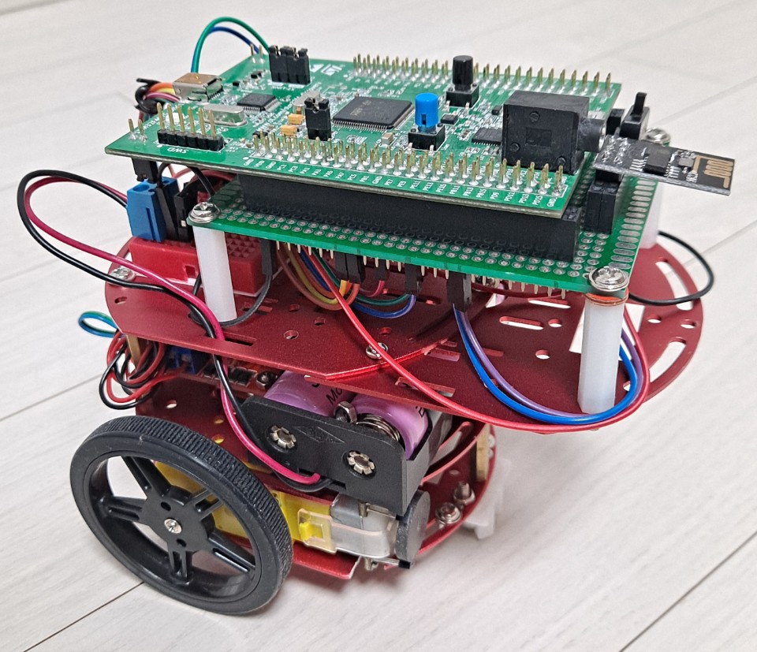

# STM32 IPS(Indoor Positioning System) Project

- GPS 신호가 들어오지 않는 실내 환경에서 추가적인 인프라의 구축 없이 센서 기반의 위치 측정 시스템을 구현한다.
- 두 개의 서로 다른 특성을 가진 센서를 융합하여 단일 센서만을 사용한 경우보다 더 좋은 성능을 내는 것을 목표로 한다.

 

# Development Environment

**OS :** Windows 10

**Compiler :** Keil uVision5

**Tool :** STM32CubeMX

**MCU :** STM32F407VG Discovery

**Sensor :** MPU9250, Encoder Motor, ESP-01

 

# Contents

### 1. 시스템 Flow

### 2. Gyro 센서

**1) Gyro 센서 특성 및 오차 보정**

- Gyro 센서를 사용할 때 센서 자체의 DC bias에 대한 오차와 온도에 의한 오차, 적분을 통한 수학적 에러에 의한 오차 등 총 3가지의 오차가 존재한다.
- 이러한 오차를 보정하기 위한 방법으로 특정 임계값보다 낮은 경우 이를 정지 상태로 간주한다. 이때 측정값에 대한 평균값을 DC bias로 설정한다. 이후 각도를 구하는 식에서 해당 값을 제거한다.

**2) Gyro 센서 회전각 측정**

- 앞서 제시한 방법을 적용하여 Gyro 센서의 각도를 측정해 보았다. 위 그림의 파란색 선은 보정하기 전 값이고 빨간색 선은 보정된 값이다. 
- 오른쪽 그림을 보면 정지한 상태에서 보정한 경우 각도의 변화가 거의 없는 반면, 보정하지 않은 경우 지속적으로 각도의 변화가 발생하는 것을 볼 수 있다.

### 3. Encoder 센서

**1) Encoder를 이용한 거리 및 회전각 측정**

- Encoder를 이용해 측정한 모터의 회전수와 바퀴의 반지름, 로봇의 중심지름을 이용하여 위의 식을 통해 로봇의 거리 및 회전각을 구할 수 있다.

### 4. Gyro/Encoder 센서 비교 및 융합

**1) 두 센서의 회전각 비교**

- 회전 시 발생하는 두 센서의 각도 변화량을 측정해 보았다. 왼쪽이 20ms, 오른쪽이  50ms의 주기로 측정한 결과이다.  

- 측정 주기가 길수록 차이가 더 크게 발생하며, 특히 정지와 같은 급격한 움직임의 변화에서 큰 차이가 발생하는 것을 볼 수 있다.

**2) 두 센서의 회전각 융합**

- 적용한 알고리즘의 목적은 두 가지다.
  - Encoder 센서의 슬립 현상 해결.
  - Gyro 센서의 사용 빈도를 최소화하여 수학적 에러에 의한 drift 현상 최소화.
- 실험을 통해 Encoder의 슬립 현상이 발생하는 구간, 비교적 선형적으로 움직이는 구간, 비선형적인 움직임이 발생하는 구간을 특정하여 각 센서의 사용 유무를 판단한다.
- 슬립 현상이 발생할 경우 Gyro만을 사용하고 비교적 차이가 적게 발생하는 구간에서 Encoder만을 사용한다. 비선형 구간에서는 비율에 따라 두 센서 모두 사용한다.

**3) 두 센서의 회전각 융합 결과(그래프)**

- 알고리즘이 적용된 각도와 Gyro 센서의 각도를 비교한 결과 Encoder에 의해 발생하는 슬립현상에 의한 오차가 많이 줄어든 것을 볼 수 있다.

- 알고리즘의 첫 번째 목적인 Encoder에 의한 슬립 현상에 대한 문제가 해결되었다.

**4) 두 센서의 회전각 융합 결과(비율)**

- 주행 경로에서 5번 측정한 결과 알고리즘에 의한 Gyro 센서만을 사용한 빈도가 전체 측정 횟수 대비 5~10% 정도의 비율을 가지는 결과가 나왔다.

- 알고리즘의 두 번째 목적인 Gyro 센서의 사용 빈도를 줄이는 것에 대한 결과를 얻게 되었다.

 

# Demo

### 위치 측정을 위한 로봇

### Encoder를 이용한 측정 결과

- Encoder를 이용한 위치 측정 결과로 슬립 현상에 의해 실제 회전 각도 보다 더 큰 값이 측정되어 안쪽으로 휘는 그래프가 형성된다.

### Gyro를 이용한 측정 결과

- Gyro를 이용한 위치 측정 결과로 비교적 정확한 위치를 형성하고 있지만, 측정 시간이 길어짐에 따라 실제 위치에서 벗어나는 현상을 발견하였다.

### 알고리즘을 적용한 측정 결과

- 알고리즘을 적용하여 위치를 측정한 결과로 알고리즘의 첫 번째 목적인 Encoder의 슬립 현상에 의한 큰 폭의 오차가 해결된 것을 볼 수 있다. 또한 Gyro만을 이용하여 측정한 결과보다 비교적 정확한 위치를 측정하고 있다. 

 

# Review

### 시스템 성능

- 단일 센서만을 사용할 경우 Encoder는 슬립 현상에 의한 급격한 각도 변화가 발생하고 Gyro는 측정 시간이 길어짐에 따라 수학적 에러 및 센서 특성에 의한 오차에 의해 오차가 누적되게 된다.
- 서로 다른 특성을 가지는 두 개의 센서를 적절히 융합하여 사용하게 됨으로써 상기의 문제들을 일정 비율 완화 시켜주는 결과를 얻게 되었다.

### 어려움

- 측정 환경 및 로봇의 특성상 장기적이고 광범위한 측정을 통한 실험 결과를 얻기 어려웠으며, 이에 따라 융합에 의한 결과와 Gyro 센서만을 이용해 측정한 결과를 정확하게 비교하기 어렵다.
- Wifi 칩인 ESP의 송신 및 수신 융합에서 발생하는 충돌 현상에 의한 문제를 해결하기 위해 칩을 Reset 시키는 방법을 사용하였다. 측정결과에 영향을 주지는 않지만 실험의 소요시간이 늘어나게 되었다.
- 배터리의 용량에 따라 측정 결과의 정확도가 달라지는 현상이 확인 되었다. 제시한 알고리즘이 Encoder가 장착된 모터에 들어가는 전기적 특성인 속도에 따라 정확도가 달라지는 것으로 판단된다. 

### 응용 분야

- GPS 신호가 들어오지 않는 실내 위치 측정
- 다양한 환경에서 기존의 위치 측정 시스템과 융합

 

# Reference

[1] 김윤기, 박재현, 곽휘권, 박상훈, 이춘우, 이장명. (2013). 저가형 관성센서를 이용한 보행자 관성항법 시스템의 성능 향상. 제어로봇시스템학회 논문지, 19(6), 569-575.

[2] 김정민, 도주철, 김성신. (2010). 엔코더와 자이로를 이용한 각속도 오차 최소화. 한국지능시스템학회 논문지, 20(6), 814-819.
